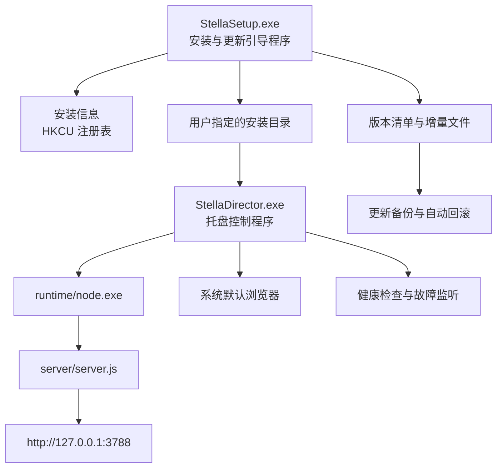
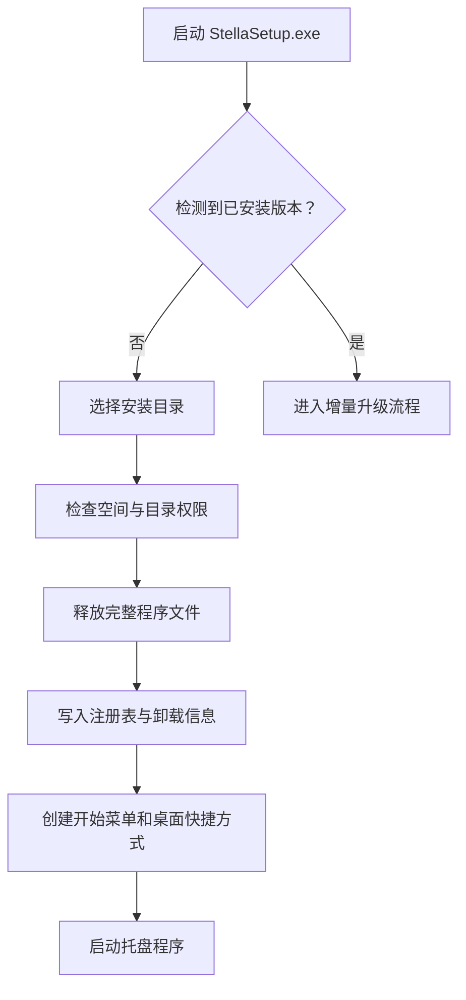
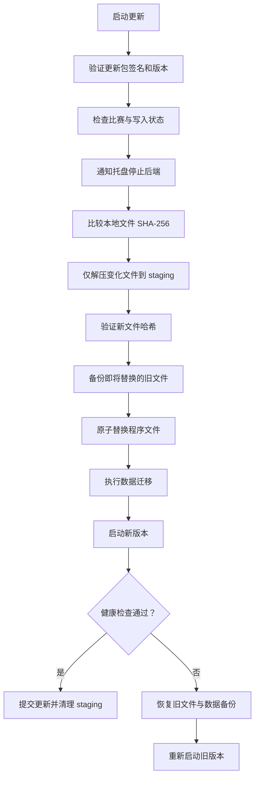
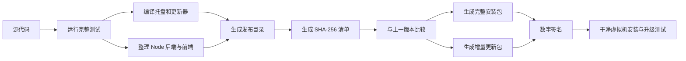

# 星澜赛事导播系统 Windows 打包与增量更新设计

## 1. 文档信息

| 项目 | 内容 |
| --- | --- |
| 产品 | 星澜赛事导播系统 |
| 目标平台 | Windows 10 / Windows 11 x64 |
| 当前系统版本 | 1.7.3 |
| 文档状态 | 已实施并进入安全验收 |
| 更新日期 | 2026-08-01 |

## 2. 建设目标

将当前 Web 控制系统打包为可以交付给无 Node.js 环境用户的 Windows 软件，并满足以下要求：

1. 首次安装时允许用户指定安装路径。
2. 提供带产品图标的常驻托盘程序。
3. 托盘程序能够静默启动、停止、重启并监听后端服务。
4. 托盘程序可以直接打开前端控制台。
5. 新版本安装程序能够识别原安装路径并执行增量升级。
6. 更新过程中保留用户数据，失败时可以自动回滚。
7. 目标电脑不需要预装 Node.js 或 .NET。

## 3. 总体架构



系统由三个交付组件组成：

| 组件 | 技术建议 | 职责 |
| --- | --- | --- |
| `StellaDirector.exe` | C# .NET 8 WinForms | 托盘、后端管理、打开前端、状态提示 |
| `StellaUpdater.exe` | C# .NET 8 | 文件校验、增量替换、回滚、重启 |
| `StellaSetup.exe` | Inno Setup 或自定义 Bootstrapper | 首次安装、路径选择、升级入口、卸载注册 |

托盘程序和更新程序发布为自包含单文件应用，不要求目标电脑安装 .NET Runtime。

## 4. 目录规划

### 4.1 程序安装目录

用户可以在首次安装时选择，例如：

```text
D:\星澜赛事导播系统
```

安装目录同时承载程序和隔离的用户数据区；升级清单只能管理 `user-data` 之外的程序文件：

```text
星澜赛事导播系统\
├─ StellaDirector.exe
├─ StellaUpdater.exe
├─ runtime\
│  └─ node.exe
├─ server\
├─ public\
├─ defaults\
├─ user-data\
│  ├─ data\
│  ├─ config\
│  ├─ logs\
│  ├─ backups\
│  └─ updates\
├─ manifest.json
└─ version.json
```

### 4.2 用户数据目录

运行期间产生的数据与程序文件分离：

```text
<InstallDir>\user-data\
├─ data\
│  ├─ bp-state.json
│  ├─ material-library.json
│  └─ obs-path-migration.json
├─ config\
│  └─ runtime-config.json
├─ logs\
├─ backups\
└─ updates\
```

以下数据不得在常规更新时覆盖：

- BP 存档与历史记录
- 素材库索引
- OBS 路径迁移记录
- OBS WebSocket 配置
- 用户上传图片记录
- 用户操作日志
- 自动启动和更新通道设置

### 4.3 外部赛事素材

赛事图片、角色素材和 OBS 场景素材继续保存在用户选择的外部目录中。业务配置和比赛记录只保存相对于素材包根目录的路径；素材库完成校验并成功同步 OBS 后，运行时再解析成绝对路径。安装器和卸载器不得复制、删除或覆盖这些文件。

注册表、开始菜单快捷方式以及自包含安装器的一次性解压缓存由 Windows 管理，可能位于系统盘，但不得包含 BP 数据、OBS 密码、赛事图片或素材库索引。托盘程序采用免解压的自包含目录发布，运行期间不在系统盘保留 .NET 单文件运行缓存。

## 5. 托盘控制程序

### 5.1 产品图标

使用现有星澜 LOGO 生成 Windows 多尺寸图标：

```text
16x16
20x20
24x24
32x32
48x48
64x64
128x128
256x256
```

托盘状态使用不同图标或状态角标：

| 状态 | 表现 |
| --- | --- |
| 后端正常 | 彩色图标 |
| 后端停止 | 灰色图标 |
| 启动或更新中 | 黄色状态角标 |
| 后端异常 | 红色状态角标 |

### 5.2 托盘菜单

```text
打开星澜赛事导播系统
----------------------
后台状态：运行正常
启动后台
停止后台
重启后台
----------------------
查看运行日志
打开安装目录
开机自动启动
检查更新
----------------------
当前版本：1.7.3
退出
```

双击托盘图标直接打开前端控制台。

### 5.3 后端启动

托盘程序以隐藏窗口启动：

```text
runtime\node.exe server\server.js
```

启动要求：

- 设置工作目录为软件安装目录。
- 设置数据目录环境变量，例如 `STELLA_DATA_DIR`。
- 使用 `CreateNoWindow`，不得弹出命令行窗口。
- 将标准输出和标准错误写入用户数据目录的日志文件。
- 保存由托盘程序启动的后端 PID。
- 使用 Windows Job Object 管理后端子进程。
- 同一用户会话只允许一个托盘实例运行。

### 5.4 后端停止

停止顺序：

1. 请求后端受控关闭接口。
2. 等待后端完成正在写入的数据并退出。
3. 超过超时时间后，仅终止托盘程序自己启动的 PID。
4. 禁止按进程名批量结束所有 `node.exe`。

托盘退出时可以让用户选择：

- 仅关闭托盘，后台继续运行。
- 同时关闭托盘和后台。

### 5.5 状态监听

后端增加健康检查接口：

```http
GET /api/system/health
```

示例响应：

```json
{
  "product": "stella-director",
  "version": "1.4.1",
  "status": "ready",
  "pid": 12345,
  "startedAt": "2026-07-30T12:00:00.000Z"
}
```

托盘程序每 2 秒检查一次：

- 后端进程是否仍然存在。
- `3788` 端口是否可访问。
- 端口上的服务是否确实为本系统。
- 后端版本是否与托盘版本兼容。
- 后端是否进入不可用状态。

异常退出时最多自动重启 3 次。连续失败后停止自动重试，显示错误通知并提供“查看日志”。

不得因为端口被占用而结束未知进程。

## 6. 前端启动流程

用户点击“打开星澜赛事导播系统”时：

1. 托盘检查后端健康状态。
2. 后端未运行时静默启动后端。
3. 等待健康检查返回 `ready`。
4. 使用 Windows Shell 打开系统默认浏览器。
5. 导航到 `http://127.0.0.1:3788/control.html`。

如果后端启动失败，不打开空白网页，直接显示错误原因和日志入口。

首版不建议使用 Electron。默认浏览器方案占用更低，也不会额外打包 Chromium。后续如需独立窗口，可增加基于 WebView2 的可选壳层。

## 7. 首次安装流程



首次安装页面包括：

- 软件名称、版本和发布者。
- 安装目录选择。
- 所需磁盘空间。
- 是否创建桌面快捷方式。
- 是否开机自动启动。
- 安装完成后是否启动软件。

默认安装目录建议为：

```text
%LocalAppData%\Programs\StellaDirector
```

用户可以改为其他有写入权限的位置。选择 `Program Files` 时安装器需要申请管理员权限。

## 8. 安装信息记录

安装信息写入：

```text
HKCU\Software\Stella\DirectorSystem
```

字段：

| 名称 | 内容 |
| --- | --- |
| `InstallDir` | 当前安装目录 |
| `Version` | 当前版本 |
| `DataDir` | 用户数据目录 |
| `UpdateChannel` | `stable` 或 `beta` |
| `AutoStart` | 是否开机启动 |
| `InstallId` | 当前安装实例唯一标识 |

同时写入 Windows“已安装的应用”卸载信息。

安装目录移动后，可以通过安装器执行“定位现有安装”重新登记。

## 9. 增量更新设计

### 9.1 版本清单

每个版本生成 `manifest.json`：

```json
{
  "product": "stella-director",
  "version": "1.5.0",
  "minimumUpgradeableVersion": "1.4.0",
  "generatedAt": "2026-08-01T10:00:00.000Z",
  "files": [
    {
      "path": "server/material-library.js",
      "size": 12840,
      "sha256": "...",
      "operation": "replace"
    },
    {
      "path": "public/assets/js/material-library.js",
      "size": 27340,
      "sha256": "...",
      "operation": "replace"
    }
  ],
  "deletedFiles": [
    "public/assets/js/obsolete-module.js"
  ],
  "dataMigrations": [
    "migrations/1.5.0.js"
  ]
}
```

所有路径必须是安装目录下的相对路径，禁止出现绝对路径和 `..`。

### 9.2 更新包类型

每次发布生成：

```text
StellaDirector-1.5.0-Full.exe
StellaDirector-1.4.1-to-1.5.0-Update.exe
```

完整包用于首次安装或无法直接升级的旧版本。

增量包只包含：

- 与上一版本相比新增的文件。
- 内容发生变化的文件。
- 删除文件清单。
- 数据迁移脚本。
- 新版本清单和签名。

### 9.3 已安装路径识别

新版本安装包启动后按以下顺序查找原安装：

1. 读取 `HKCU\Software\Stella\DirectorSystem`。
2. 验证 `InstallDir` 下的产品标识和版本文件。
3. 注册表失效时允许用户手动定位现有安装目录。
4. 验证通过后沿用原安装路径，不要求重新选择。

### 9.4 更新事务



更新步骤：

1. 校验安装实例、当前版本和更新包签名。
2. 检查是否有正在进行的 BP、上传或文件写入。
3. 请求托盘和后端进入更新状态。
4. 计算本地目标文件 SHA-256。
5. 仅释放哈希不同或不存在的文件。
6. 写入 `<InstallDir>\user-data\updates\staging`。
7. 验证 staging 中所有文件。
8. 备份将被替换和删除的旧程序文件。
9. 使用同卷临时文件完成原子替换。
10. 执行版本化数据迁移。
11. 写入新版本号。
12. 启动新版本并进行健康检查。
13. 健康检查通过后提交更新。

### 9.5 回滚条件

出现以下任一情况立即回滚：

- 更新包签名无效。
- 文件哈希校验失败。
- 文件替换失败。
- 数据迁移失败。
- 新后端无法启动。
- 新版本健康检查超时。
- 产品版本与清单不一致。

回滚恢复：

- 被替换的程序文件。
- 被更新删除的程序文件。
- 数据迁移前的用户数据快照。
- 注册表中的原版本号。

默认保留最近两个成功版本的程序备份。

## 10. 更新限制

以下状态下不得直接执行更新：

- BP 正在进行。
- 正在上传或写入赛果图。
- OBS 路径迁移事务正在运行。
- 素材库正在执行文件系统删除。
- 后端存在未完成的关键写操作。

更新器必须显示阻止更新的具体原因，不允许强制结束关键写入。

## 11. 安全要求

- 安装程序、托盘程序和更新程序使用 Authenticode 签名。
- 更新清单进行独立数字签名。
- 更新包必须验证产品 ID、目标版本和支持的源版本。
- 更新路径必须限制在已登记安装目录内。
- 非空目录只有在安装清单哈希与注册表登记一致时才允许升级，禁止覆盖普通文件夹。
- 禁止更新程序处理绝对路径、目录穿越或符号链接逃逸。
- 卸载器只删除清单中登记的程序文件；未知文件即使位于安装目录也必须保留。
- 删除用户数据前必须确认目标恰好为 `<InstallDir>\user-data`，并按不跟随重解析点的方式遍历。
- 后端默认仅监听 `127.0.0.1`。
- 控制接口不得直接结束未知 PID。
- 更新器不得修改外部赛事素材和 OBS 场景集合文件。

## 12. 卸载策略

卸载时分别询问：

1. 是否删除程序文件。
2. 是否保留 BP 存档、配置和日志。
3. 是否保留素材库索引。

默认行为：

- 按经过哈希校验的安装清单删除程序文件。
- 保留用户数据。
- 不删除任何外部赛事素材。
- 不修改 OBS 设置。

安装目录不是空目录、磁盘根目录、目录联接或无法验证为本产品时，安装与卸载必须封闭失败。禁止以 `rmdir /s` 或等价操作递归删除整个安装目录。

## 13. 构建与发布流程



发布脚本执行：

1. 验证工作区版本号与 `data/update-log.json` 一致。
2. 执行 Node.js 完整测试。
3. 编译自包含托盘程序和更新程序。
4. 复制后端、前端和内置 Node.js Runtime。
5. 排除测试目录、日志、运行状态和开发机配置。
6. 生成完整文件哈希清单。
7. 与上一版本清单比较并生成增量文件集。
8. 生成完整安装包和增量更新包。
9. 对可执行文件和安装包签名。
10. 在干净 Windows 环境验证首次安装、升级、回滚和卸载。

## 14. 当前项目需要的改造

正式打包前必须完成：

1. 将可变数据从项目 `data` 目录迁移到统一用户数据目录。
2. 将日志输出迁移到用户数据目录。
3. 增加 `/api/system/health` 健康检查接口。
4. 增加仅允许本机托盘调用的受控关闭接口。
5. 增加后端关键操作忙碌状态。
6. 将端口、数据目录和日志目录改为环境变量或配置项。
7. 移除发布包中的开发机绝对路径默认值。
8. 为旧版项目内数据提供一次性迁移程序。
9. 建立程序文件与用户数据的边界清单。
10. 建立自动生成完整包和增量包的发布脚本。

## 15. 分阶段实施

### 阶段一：运行目录标准化

- 完成用户数据目录迁移。
- 增加健康检查和受控退出。
- 增加后端实例与端口身份识别。

验收标准：直接移动程序安装目录后仍可运行，用户数据不丢失。

### 阶段二：托盘程序

- 完成图标、托盘菜单和单实例控制。
- 完成后端静默启停与健康监听。
- 完成默认浏览器启动前端。

验收标准：无 Node.js 和 .NET 环境的电脑可以通过托盘启动系统。

### 阶段三：首次安装包

- 支持自定义安装路径。
- 创建快捷方式、卸载入口和注册表记录。
- 支持开机自动启动。

验收标准：全新 Windows 用户可以独立完成安装、运行和卸载。

### 阶段四：增量更新

- 生成版本清单和差异文件。
- 实现 staging、哈希校验、原子替换和回滚。
- 实现跨版本数据迁移。

验收标准：更新包只替换变化程序文件，用户数据和外部素材保持不变。

### 阶段五：发布安全

- 完成数字签名。
- 完成稳定版和测试版更新通道。
- 建立虚拟机自动安装与升级测试。

## 16. 最终验收场景

至少验证以下场景：

1. 无 Node.js、无 .NET 环境首次安装。
2. 安装到默认路径。
3. 安装到其他磁盘和中文路径。
4. 托盘静默启动和停止后端。
5. 后端崩溃后的有限自动重启。
6. `3788` 被其他程序占用时不误杀进程。
7. 从托盘直接打开控制台。
8. 从上一版本执行增量更新。
9. 跨过多个版本执行更新。
10. 更新中途断电或终止后的恢复。
11. 新版本健康检查失败后的自动回滚。
12. 更新后 BP 存档、素材库和 OBS 配置保持不变。
13. 卸载程序但保留用户数据。
14. 重装后识别并复用已保留的数据。

## 17. 关键决策

| 决策 | 结论 |
| --- | --- |
| 桌面壳技术 | C# .NET 8 WinForms 自包含发布 |
| 前端承载 | 首版使用系统默认浏览器 |
| 后端 Runtime | 继续内置 Node.js |
| 安装范围 | 默认当前用户安装，允许自定义路径 |
| 数据位置 | `<InstallDir>\user-data` |
| 更新方式 | 文件哈希清单驱动的增量事务 |
| 回滚范围 | 程序文件、版本记录和数据迁移快照 |
| 外部素材 | 安装和更新过程均不处理 |

最重要的前置条件是先完成程序文件与用户数据分离。在此之前直接制作安装包，会继续面临更新覆盖数据、安装目录权限和运行时 `EPERM` 等问题。
